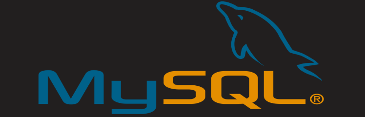

<div align="center"> 
    
</div>

<br>
<br>

# Sumario
   - [Sobre](#sobre)
   - [Tecnologias](#tecnologias-utilizadas)
   - [Habilidades](#habilidades-desenvolvidas)
   - [Instruções](#instruções)
#

# Sobre

### Projeto desenvolvido enquanto estudante na [trybe](https://www.betrybe.com/formacao-desenvolvimento-web), o intuito desse projeto foi melhorar fixação do conteúdo de introdução ao Sql. Foram desenvolvidas queries em forma de desafios. Alguns requisitos foram entregues para desenvolvermos as mesmas.

#

# Tecnologias utilizadas
- [SQL](https://www.w3schools.com/sql/)
- [MySQL Workbench](https://www.mysql.com/products/workbench/)

#

# Habilidades desenvolvidas

- Entender o funcionamento de um banco de dados
- Gerar consultas SQL contendo:
    - SELECT
    - CONCAT
    - DISTINCT
    - COUNT
    - LIMIT
    - OFFSET
    - ORDER BY
    - WHERE
    - LIKE
    - IN
    - BETWEEN
    - INSERT
    - UPDATE
    - DELETE
#

# Instruções

```bash
    # Clonar repositório

    $ git clone git@github.com:furquin/introducao-mySql.git

    # Entrar no diretório

    $ cd introducao-mySql

```

<br>
<br>
<br>

### Desenvolvido por [Laert Furquin](https://github.com/furquin) 

